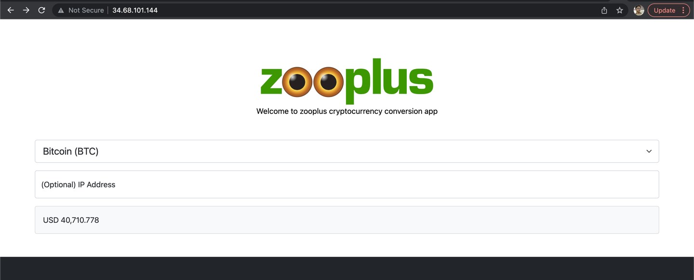

# Zooplus - Cryptocurrency Conversion

The purpose of this coding exercise is to implement a JAVA web application to fetch the
current localized price of a cryptocurrency.

It is important that the price is displayed with currency symbol and correct decimal separator.

**If the IP entered is not valid conversion will be returned in EUR.**

# Application Link - http://34.68.101.144/



# Currency Conversion Data
Below APIs are used to fetch cryptocurrency conversion and IP location
## Cryptocurrency API
- [CoinLayer] (https://coinlayer.com)
## IP Location API
- [ip-api] (https://ip-api.com)

# Technology Stack
- Spring Boot
- Google Cloud Platform (GCP)
- Docker
- Kubernetes

## Libraries and Plugins
- ThymeLeaf
- Spring Developer Tools
- SpringDoc


# Installation
## Prerequisites
- JAVA 11
- Apache Maven

## Execution
```
mvn clean package
java -jar target/zooplus-assignment-0.0.1-SNAPSHOT.jar
```
## Testing
```
mvn test
```

# Continuous integration and Continuous delivery 
GitHub action is used here to create 2 workflows
## Continuous Integration (will be triggered on push and pull requests
- Build the application and run unit test using Maven
## Deploy to GKE (Google Cloud Platform)
- Deploy the application to Google Cloud

# API Documentation
- [Swagger] (http://34.68.101.144/swagger-ui/index.html) API documentation
- [Swagger] (http://34.68.101.144/api-docs) API docs
